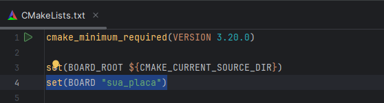
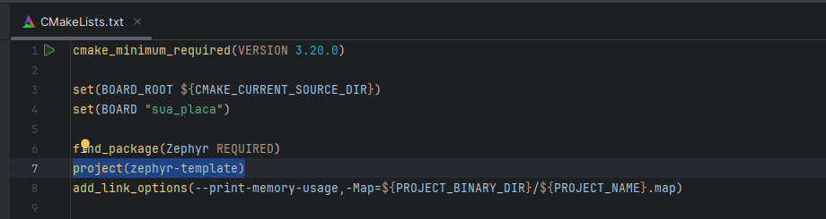
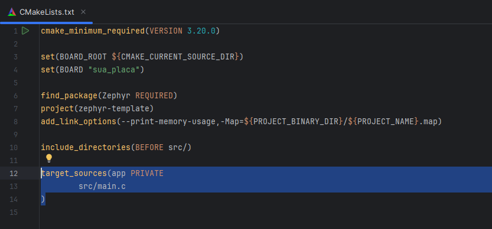
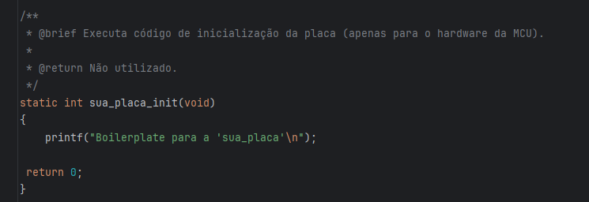
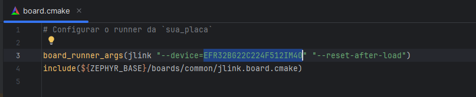
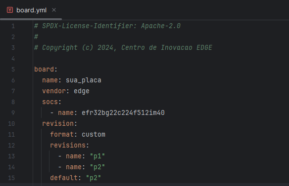

# *Zephyr Template*

Repositório de template para criação de projetos em sistemas embarcados com Zephyr.
\
Para um guia
geral: [Zephyr Projects](https://docs.zephyrproject.org/latest/develop/application/index.htm)

Passando pelos principais arquivos de configuração:

## CMakeLists.txt

*Aqui temos o CMakeLists geral do projeto, CMake é usado para construir sua aplicação junto com o
kernel Zephyr. A construção com CMake ocorre em duas etapas. A primeira etapa é chamada de
configuração. Durante a configuração, os scripts de construção CMakeLists.txt são executados. Após a
configuração, o CMake possui um modelo interno da construção do Zephyr e pode gerar scripts de
construção nativos para a plataforma hospedeira. O processo de construção com CMake e Zephyr pode
ser comparado ao uso de Makefile, mas com algumas diferenças fundamentais e vantagens específicas.*
\
\
Definimos a variável de ambiente para o nome da placa que usaremos, que por ser *out of tree* (não
pertence ao repositório do Zephyr) deve ter a variável `BOARD_ROOT` configurada de acordo. Aqui
estamos indicando ao CMake onde procurar pelos arquivos de definição da placa, e qual placa deve ser
usada durante a compilação do projeto.:



\
\
Em segundo lugar, definimos o nome do projeto:


\
\
Obs: O nome deve ser o mesmo do nome do arquivo principal do projeto(Sendo uma boa prática e
evitando problemas de compatibilidade):


\
Em terceiro lugar, definimos o target do projeto:



## Kconfig

*Aqui podemos criar configurações que não precisam estar hard-coded no código, podendo ser
configuradas via menuconfig. Embora as configurações sejam usadas no código, elas não precisam ser
fixadas diretamente nele.*

\
*Há Vantagens de usar Kconfig no lugar de #define, Kconfig permite organizar configurações de forma
hierárquica e estruturada, facilitando a manutenção do código, Utilizando ferramentas como
menuconfig, os desenvolvedores podem configurar opções de maneira interativa.*

\
Para acessar o menu config basta mandar (no terminal):

 ```shell
 west build -t menuconfig
 ```

\
Para entender mais
sobre: [KCONFIG](https://docs.zephyrproject.org/latest/build/kconfig/index.html)

## prj.conf

o prj.conf é uma configuração manual dos parâmetros definidos em Kconfig.

No arquivo, adicionamos como exemplo:

**CONFIG_DEBUG_OPTIMIZATIONS=y**

Que otimiza a experiência de debug, seguem
detalhes: [CONFIG_DEBUG_OPTIMIZATIONS](https://docs.zephyrproject.org/latest/kconfig.html#CONFIG_COMPILER_OPTIMIZATIONS).

O sistema de compilação procura prj.conf por padrão, mas você pode adicionar mais fragmentos Kconfig
e outros arquivos padrão também são pesquisados.

## Boards

Aqui temos configurações próprias da placa.
\
**Lembrando que precisamos mudar o diretório "edge" para a empresa da placa e "sua_placa" o nome da
placa.**

### board.c

Neste arquivo podemos escrever códigos usados durante a inicialização da placa:

\
Lembrando de substituir o nome da placa, podendo alterar também os parâmetros usados no SYS_INIT.

### board.cmake

Aqui definimos os argumentos do runner da placa/mcu.

Por exemplo, abaixo vemos dois argumentos, o que especifica a placa e que diz para resetar após o
load.


### board.yml

O arquivo descreve a placa em alto nível. Isso inclui o SoC, variantes e revisões da placa.

\
Sendo necessário alterar o nome da placa, o vendor e o nome da SoC.

Para mais detalhes dos parâmetros usados na definição da
placa: [Board Terminology](https://docs.zephyrproject.org/latest/hardware/porting/board_porting.html#board-terminology)

### Arquivos DTS

O arquivo devicetree boards/<edge>/sua_placa/sua_placa.dts ou boards/<edge>
/sua_placa/sua_placa_<qualifiers>.dts
descreve o hardware da sua placa no formato Devicetree Source (DTS) (como de costume, altere
sua_placa para o seu real
nome).

Para entender mais sobre: [DTS](https://docs.zephyrproject.org/latest/build/dts/index.html)